Python StatsD Client
====================

``python-statsd`` is a client for Etsy's statsd server, a front end and
proxy for the Graphite stats collection and graphing server. It supports
Python 3.10 and newer, and it has no dependencies.

Install it, point it at a server, and send something:

.. code-block:: bash

   pip install python-statsd

.. code-block:: python

   import statsd

   counter = statsd.Counter('app')
   counter += 1

   with statsd.Timer('app').time('render'):
       render_page()

Those two metrics arrive as ``app:1|c`` and ``app.render:12.4|ms``, one
UDP packet each. Nothing blocks, nothing is retried, and a statsd server
that is down costs you graphs rather than requests.

Where to go next
----------------

- :doc:`metrics` covers the five metric types, how to choose between them,
  and the exact bytes each one writes.
- :doc:`connections` covers destinations, sampling, disabling and what
  happens when a send fails.
- :doc:`patterns` covers naming, client trees, web framework integration
  and the decisions that age badly.
- :doc:`local-stack` brings up statsd, Graphite and Grafana with one
  command so you can watch a metric land.

.. toctree::
   :hidden:
   :maxdepth: 2
   :caption: Guide

   metrics
   connections
   patterns
   local-stack

.. toctree::
   :hidden:
   :maxdepth: 2
   :caption: Reference

   api/index

Links
-----

- The source: https://github.com/WoLpH/python-statsd
- Project page: https://pypi.org/project/python-statsd/
- Reporting bugs: https://github.com/WoLpH/python-statsd/issues
- Contributing: https://github.com/WoLpH/python-statsd/blob/develop/CONTRIBUTING.md
- Django integration: https://github.com/wolph/django-statsd
- Statsd: https://github.com/etsy/statsd
- Graphite: https://graphiteapp.org/

Indices and Tables
==================

* :ref:`genindex`
* :ref:`modindex`
* :ref:`search`
